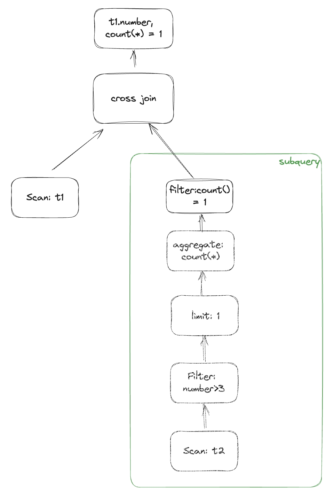
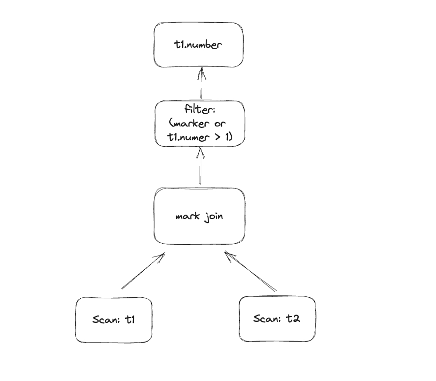

在SQL查询中，子查询是一种常用的技术，它允许我们在一个查询内部嵌套另一个查询，以实现更复杂的数据检索和分析。
如何在数据库内核中高效的处理子查询是非常有挑战的，本文将介绍如何在 databend 中构建 state-of-art 的子查询 optimizer。


从宽泛的角度，子查询分为关联和非关联子查询, 细分的种类包含：SCALAR/ANY/ALL/SOME/(NOT)IN/(NOT)EXISTS. 对于每一种子查询的含义，读者可以参考: https://www.postgresql.org/docs/current/functions-subquery.html 。尽管子查询有这么多种，但是在 databend 中，我们只需要处理 SCALAR/EXISTS/ANY 三种子查询，因为在 binder 阶段，可以做如下 SQL 语义等价转换:
- `in` => `= any(...)`
- `i > all()` => `not(i <= any(...))`
- `some` => `any`

子查询几乎可以出现在 SQL 的任何位置，如 `from/where/select/group by/having/order by`, 外加关联子查询的存在，所以处理子查询变得具有挑战性，在深入子查询之前，先介绍一下 databend 为了高效处理子查询
而引入的非标准 join 类型： **single join** 和 **mark join**。

- single join: single join 的存在是为了处理 scalar 子查询，left single join 与 left outer join 类似，但是如果超过一个 join partner 被发现就会报错，这点对应 scalar 子查询只产生一列且最多一行结果。
- mark join: mark join 引入了一个新的属性：mark, 用来标记 tuple 是否有 join partner. 其值可以是 `TRUE, FALSE, NULL`, 可以用来处理 ANY/EXISTS 子查询

有了这两种非标准 join， 我们可以保证所有的子查询在经过子查询 optimizer 后已经全部转化为 join, 这为 join reorder 提供了更多的可能，可以大幅降低执行代价。

### 非关联子查询

非关联子查询的处理相对简单，只需要做简单的变换即可。下面通过几个简单的例子来看一下如何展开非关联子查询:

1. 非关联 scalar 子查询 `select number, (select number from numbers(10) as t2 where number > 3 limit 1) from numbers(10) as t1`， 直接用 single join即可
   
2. 非关联 exists 子查询 `select number, exists(select * from numbers(10) as t2 where number > 3) from numbers(10) as t1;`, 给子查询加上 `limit 1`, `count(*)` 和 `count(*) = 1` operator, 其中 `limit 1` 可以使查询更加高效，因为只需要判断是否存在即可
   
3. 非关联 any 子查询 `select number from numbers(10) as t1 where number > any(select number from numbers(20) as t2) or number > 1;`， 在这条 SQL 中，因为包含 disjunction predicate，所以不能用 semi join 来对转化子查询，mark join 的 mark 列将替换子查询 => `marker or number > 1`
   

### 关联子查询

在介绍关联子查询前，需要引入 **dependent join**, dependent join 会为 LHS 中的每一行执行一次 RHS


核心思想在于如何消除 dependent join 中的 correlated columns?

下面通过一条 ANY 关联子查询来看一下是如何去关联的

`select a from t1 where a > any(select b from t2 where t1.a < 1) or a > 1;`
```
mysql> desc t1;
+-------+-----------------+------+---------+-------+
| Field | Type            | Null | Default | Extra |
+-------+-----------------+------+---------+-------+
| a     | BIGINT UNSIGNED | NO   | 0       |       |
+-------+-----------------+------+---------+-------+
1 row in set (0.03 sec)
Read 0 rows, 0.00 B in 0.015 sec., 0 rows/sec., 0.00 B/sec.

mysql> desc t2;
+-------+-----------------+------+---------+-------+
| Field | Type            | Null | Default | Extra |
+-------+-----------------+------+---------+-------+
| b     | BIGINT UNSIGNED | NO   | 0       |       |
+-------+-----------------+------+---------+-------+
1 row in set (0.03 sec)
Read 0 rows, 0.00 B in 0.017 sec., 0 rows/sec., 0.00 B/sec.
```
子查询中包含 correlated column `t1.a`, 核心的一步就是对子查询中的表进行扩展(cross join)，**t2 x t1(a)**, 扩展后的子查询自然就完成了去关联。


扩展后的表假设叫 t3 包含两列(b, a'), t3 会与 t1 进行 mark join, 返回 (t1.a, mark) 两列，mark 列用于 filter: `mark or a > 1` 中，对 mark join 后的结果进行进一步过滤


这里需要注意的是 mark join 的 equi condition 和 non-equi condition.


至此，子查询处理的核心思想已经介绍完了。还有很多工程上的优化和特殊情况就不展开讲述了，比如
1. 如何正确的处理 NULL, 特别是在 mark join 的实现中，NULL 的正确处理对子查询结果的正确性非常重要
2. 在对子查询中的表进行拓展时，直接 cross join 有一定的开销，能否避免 cross join?
3. mark join 在什么情况下可以转化为 semi join?
4. ......

纵观全文，所有的子查询最终的形态都是 join, 所以 join 的性能很大程度上决定了子查询的性能，下一篇博客讲一讲 databend join 从 0 到 1 的一个迭代过程。
