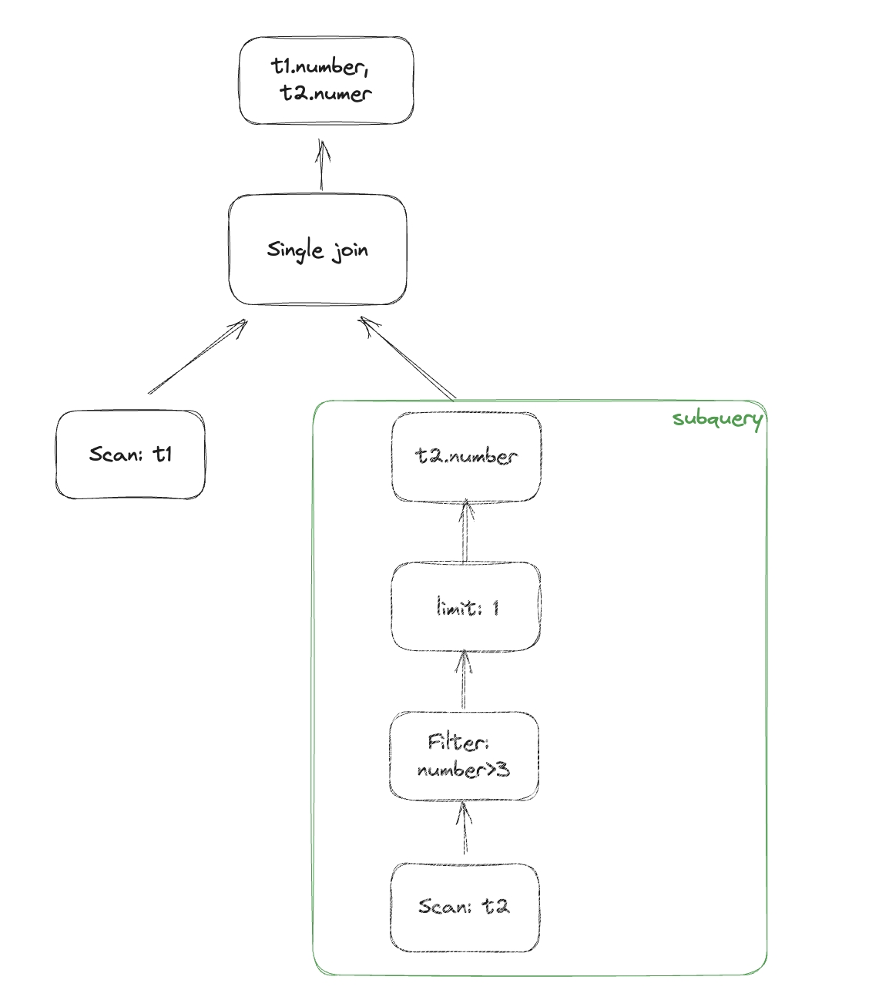
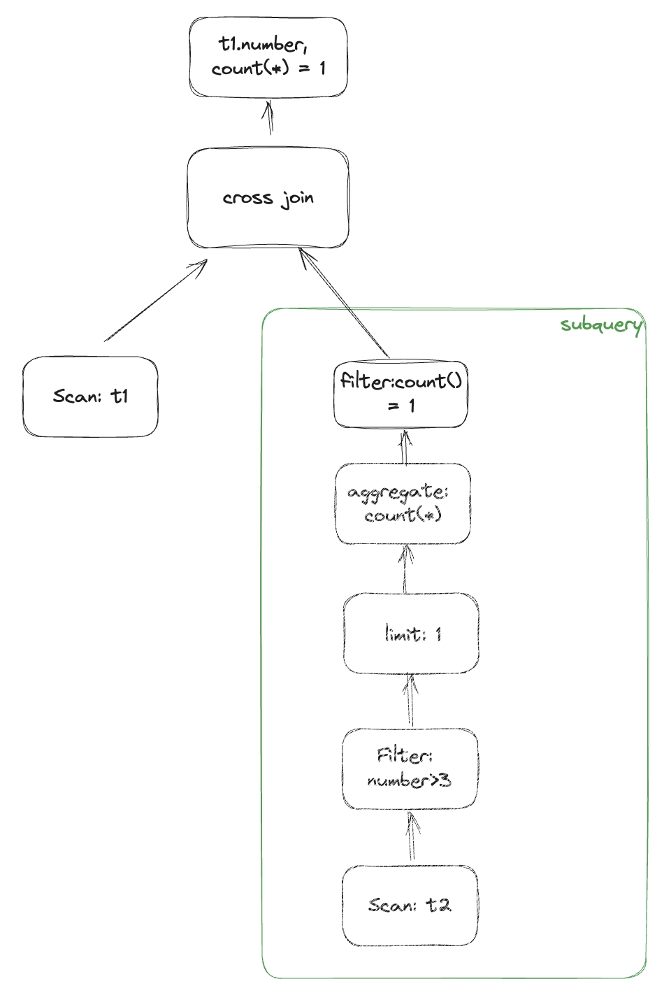
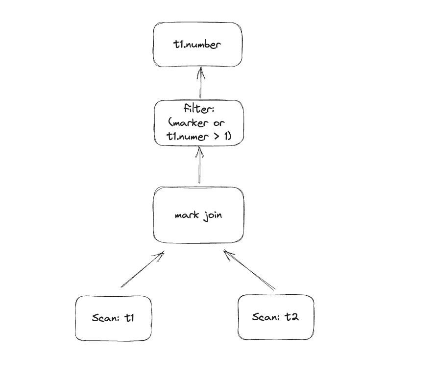
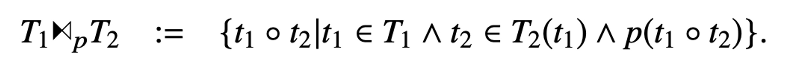
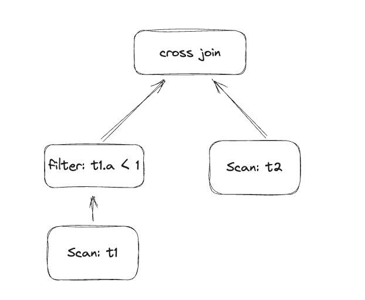
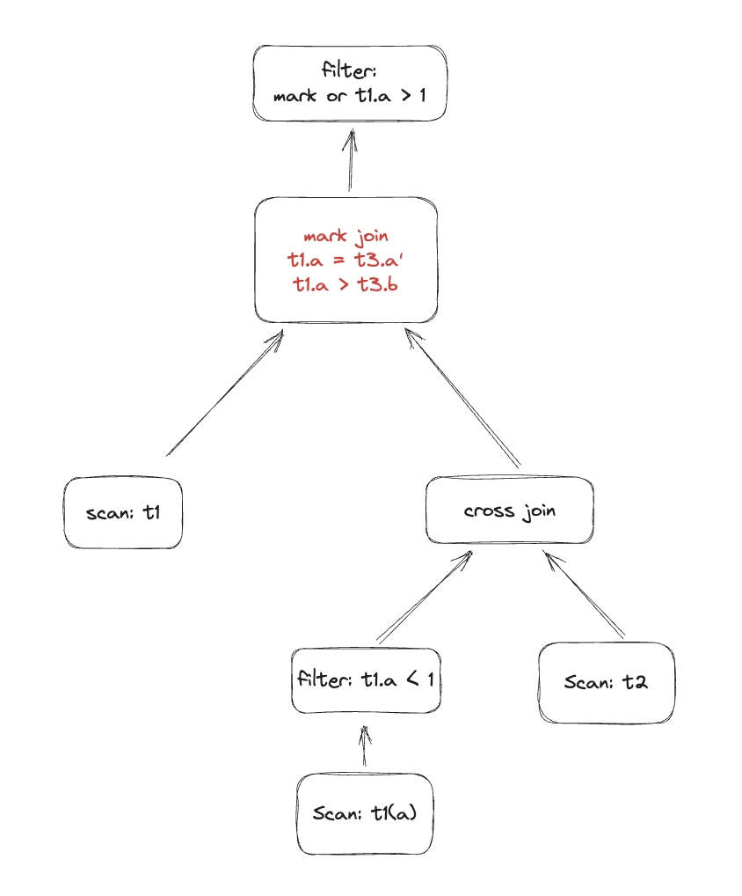

In SQL queries, subquery is a common technique that allows us to nest one query inside another to achieve more complex data retrieval and analysis. However, efficiently handling subqueries within a database kernel is a significant challenge. This article will introduce how to build a state-of-the-art subquery optimizer in Databend.

From a broad perspective, subqueries can be divided into correlated and non-correlated subqueries, and further types include SCALAR/ANY/ALL/SOME/(NOT)IN/(NOT)EXISTS. Readers can refer to https://www.postgresql.org/docs/current/functions-subquery.html for the meaning of each type of subquery. Although there are many types of subqueries, in Databend, we only need to handle three types: SCALAR/EXISTS/ANY, because the following SQL semantic equivalent transformation can be done in the binder phase:

- `in` => `= any(...)`
- `i > all()` => `not(i <= any(...))`
- `some` => `any`

Subqueries can appear in almost any part of a SQL query, such as `from/where/select/group by/having/order by`, in addition to the existence of correlated subqueries. Therefore, handling subqueries can be challenging. Before delving into subqueries, let's first introduce the non-standard join types introduced by Databend to efficiently handle subqueries: **single join and mark join**.

- single join: The existence of single join is to handle scalar subqueries. Left single join is similar to left outer join, but an error will be reported if more than one join partner is found. This corresponds to scalar subqueries that produce only one column and a maximum of one row of results.
- mark join: Mark join introduces a new attribute, "mark," to indicate whether a tuple has a join partner. Its value can be TRUE, FALSE, NULL and can be used to handle ANY/EXISTS subqueries.

With these two non-standard joins, we can ensure that all subqueries have been transformed into joins after going through the subquery optimizer, providing more chances for join reorder and significantly reducing execution costs.

### Non-correlated subquery

Handling non-correlated subqueries is relatively simple and only requires simple transformations. Let's look at how to expand non-correlated subqueries through a few simple examples:

1. scalar subquery: `select number, (select number from numbers(10) as t2 where number > 3 limit 1) from numbers(10) as t1`， single join is enough.
   

2. exists subquery: `select number, exists(select * from numbers(10) as t2 where number > 3) from numbers(10) as t1;` Adding `LIMIT 1`, `COUNT(*)`, and `Filter(COUNT(*) = 1)` operators to subqueries. The LIMIT 1 operator can make the query more efficient because it only needs to determine whether a result exists or not.
  

3. any subquery: `select number from numbers(10) as t1 where number > any(select number from numbers(20) as t2) or number > 1;`, In this SQL query, because it contains a **disjunction predicate**, we cannot use a semi join to transform the subquery. Instead, the mark column of the mark join will replace the subquery, so filter will be `marker or number > 1`.
   

### Correlated subquery

Before introducing correlated subqueries, we need to introduce **dependent join**." Dependent join executes RHS for each row of LHS.



The core idea is how to eliminate correlated columns in dependent join?

Let's take a look at how to eliminate correlation in a ANY correlated subquery through an example:

`select a from t1 where a > any(select b from t2 where t1.a < 1) or a > 1;`
```
mysql> desc t1;
+-------+-----------------+------+---------+-------+
| Field | Type            | Null | Default | Extra |
+-------+-----------------+------+---------+-------+
| a     | BIGINT UNSIGNED | NO   | 0       |       |
+-------+-----------------+------+---------+-------+
1 row in set (0.03 sec)
Read 0 rows, 0.00 B in 0.015 sec., 0 rows/sec., 0.00 B/sec.

mysql> desc t2;
+-------+-----------------+------+---------+-------+
| Field | Type            | Null | Default | Extra |
+-------+-----------------+------+---------+-------+
| b     | BIGINT UNSIGNED | NO   | 0       |       |
+-------+-----------------+------+---------+-------+
1 row in set (0.03 sec)
Read 0 rows, 0.00 B in 0.017 sec., 0 rows/sec., 0.00 B/sec.
```

The subquery contains a correlated column `t1.a`, the core step is to expand the table in the subquery (cross join) by **t2 x t1(a)**. The expanded subquery naturally completes the elimination of correlation.



The expanded table, let's call it `t3`, contains two columns `(b and a')`. t3 will undergo a mark join with `t1` to return two columns `(t1.a and mark)`. The mark column is used for filtering the results further with the condition `mark or a > 1`, applied to the mark join result.



With this, the core idea of subquery processing has been introduced. There are many engineering optimizations and special cases that we have not discussed, such as:

1. How to handle **NULL** values correctly, especially in the implementation of mark join, where the correct handling of NULL is crucial for the correctness of subquery results.
2. When expanding tables in a subquery, cross join can be costly. Is it possible to avoid cross join?
3. Under what circumstances can mark join be transformed into a semi join?
4. ...

Throughout this article, all subqueries are ultimately transformed into joins, so the performance of joins largely determines the performance of subqueries. In the next blog post, we will discuss the iterative process of developing Databend's join from scratch.